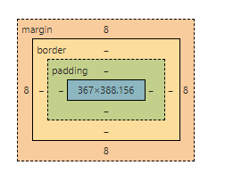
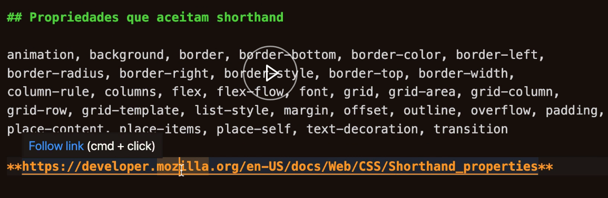

<details> 
<summary>
<h1 style=" display: inline">✅ O que é CSS</h2>
</summary>
<br>
<br>

## Cascading Style Sheaths

_Basicamente o CSS muda o estilo das páginas do front-end fazendo com que fiquem mais bonitas, ou seja ele traz a beleza para as páginas_

- [x] **anatomia**
- [x] **seletores** _tags do html, #id .class,_
- [x] **propriedade** _width, margin..._
- [x] **valor** _10rem, 10px, center..._
- [x] **caixas**
  - 
- [] **Adicionando CSS**

```html
<head>
  <link rel="stylesheet" href="local do arquivo" />
</head>
```

```css
@import "http://fonts.googleapis.com/css?family=";

h1 {
  font-family: "fonte escolhida no google";
}
```

- [x] Cascata _segue o fluxo do arquivo_
- [x] Origem do estilo de onde vem importa, força do estilo quando chamado por ordem a primeira é mais forte que a seguinte: _inline `direto na tag do html` > tag style `<style>`> tag link_ `<link>`
- [x] Especificidade

  - .0 ↔ `*` Universal selector, combinators e negation pseudo-class `(:not())`
  - .1 ↔ Element type selector e pseudo-elements `(::before, ::after)`
  - .10 ↔ Classes e atributos selectors `([type="radio"])`
  - .100 ↔ ID selectors
  - .1000 ↔ Inline

- [x] `!important` sobreescreve tudo e qualquer força
- [x] At-rules

  - `@import` /_inclui um CSS esterno_/
  - `@media` /_regras condicionais para dispositivos_/
  - `@font-face` /_fontes externas_/
  - `@keyframes` /_Animation_/

- [x] Shorthand /_em suma é diminuir a quantidade de propriedades especificando apenas uma propriedade e inserindo os valores nela_/

```css
* {
  /* font properties */
  font-style: italic;
  font-weight: bold;
  font-size: 8rem;
  line-height: 1.2;
  font-family: Arial, sans-serif;

  /* font shorthand */
  font: italic bold 0.8em/1.2 Arial, sans-serif;
}
```

- 
- [x] Funções `url(), rgb(), calc()...`
- [x] Devtools `f12 no browser`
- [x] Vendor-prefixes _usado para tornar a propriedade usaveis em navegadores que não tem compatibilidade_
  - `-webkit-`
  - `-moz-`
  - `-ms-`
  - `-o-`
  </details>
